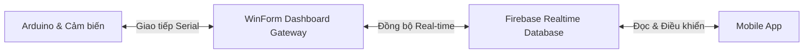

# Hướng dẫn Kết nối & Phát triển Ứng dụng Mobile (Smart Agriculture System)

Tài liệu này cung cấp chi tiết về kiến trúc hệ thống, cấu trúc dữ liệu trên Firebase Realtime Database (RTDB) và hướng dẫn cách lập trình ứng dụng di động (Android / iOS / Flutter / React Native) để đọc dữ liệu và điều khiển thiết bị thông qua hệ thống phần mềm WinForm đóng vai trò làm Gateway.

---

## 1. Kiến trúc Hệ thống
Hệ thống hoạt động theo mô hình **Bridge/Gateway** hai chiều:


* **WinForm Dashboard** kết nối trực tiếp với mạch Arduino qua cổng COM (Serial Port), nhận dữ liệu cảm biến thô, chuẩn hóa cấu trúc và đồng bộ hóa liên tục lên Firebase.
* **Mobile App** kết nối trực tiếp với Firebase RTDB để lấy dữ liệu môi trường thời gian thực và ghi lệnh điều khiển mà không cần giao tiếp trực tiếp với cổng Serial của máy tính.

---

## 2. Cấu trúc Cơ sở dữ liệu Firebase (JSON Schema)
Toàn bộ dữ liệu của hệ thống được tổ chức bên dưới node gốc `smart_agri`. Cấu trúc chi tiết như sau:

```json
{
  "smart_agri": {
    /* 1. Thông số môi trường thời gian thực (Cập nhật liên tục mỗi giây) */
    "sensors": {
      "temp_air": 30.5,       // Nhiệt độ không khí (°C) - Kiểu float
      "hum_air": 75.0,        // Độ ẩm không khí (%) - Kiểu float
      "hum_soil": 60,         // Độ ẩm đất (%) - Kiểu int
      "light_level": 85       // Cường độ ánh sáng (%) - Kiểu int
    },
    
    /* 2. Trạng thái hoạt động thực tế của thiết bị (1: Bật, 0: Tắt) */
    "devices": {
      "pump": 0,              // Máy bơm nước - Kiểu int (0/1)
      "fan": 0,               // Quạt gió tản nhiệt - Kiểu int (0/1)
      "light": 0              // Đèn chiếu sáng - Kiểu int (0/1)
    },
    
    /* 3. Cấu hình chế độ, ngưỡng tự động và lịch trình */
    "settings": {
      "control_mode": "MANUAL", // Chế độ hoạt động: "AUTO" (Tự động) hoặc "MANUAL" (Thủ công)
      
      /* Các ngưỡng để Arduino tự động bật thiết bị khi ở chế độ AUTO */
      "auto_thresholds": {
        "soil_min": 30,       // Độ ẩm đất dưới mức này sẽ bật máy bơm (%)
        "soil_max": 80,       // Độ ẩm đất đạt mức này sẽ tắt máy bơm (%) (Mặc định: 80)
        "temp_max": 31,       // Nhiệt độ không khí trên mức này sẽ bật quạt (°C)
        "light_min": 40       // Cường độ ánh sáng dưới mức này sẽ bật đèn (%)
      },
      
      /* Danh sách lịch hẹn giờ hoạt động của các thiết bị (Do WinForm/Mobile thiết lập) */
      "schedules": {
        "sch_1781293812": {
          "id": "sch_1781293812",       // ID duy nhất của lịch trình (Dạng chuỗi)
          "device": "pump",              // Thiết bị áp dụng: "pump", "fan", hoặc "light"
          "enabled": true,               // Trạng thái kích hoạt lịch trình: true/false
          "mode": "weekly",              // Kiểu lặp: "once" (Một lần), "daily" (Hàng ngày), "weekly" (Hàng tuần)
          "once_date": "2026-06-21",     // Ngày chạy (định dạng yyyy-MM-dd) - Chỉ dùng khi mode là "once"
          "repeat_days": [1, 3, 5],      // Mảng chứa các thứ lặp lại (1: Thứ 2, ..., 7: Chủ Nhật) - Dùng cho "weekly"
          "start_time": "08:30",         // Giờ bắt đầu chạy (định dạng HH:mm)
          "duration_minutes": 45         // Thời lượng thiết bị hoạt động (số phút)
        }
      }
    },
    
    /* 4. Nhãn thời gian của lần cập nhật trạng thái gần nhất */
    "last_update": "2026-06-21 19:00:00",
    
    /* 5. Nhánh lịch sử logs dùng để vẽ biểu đồ (lưu trữ trong 1 giờ qua) */
    "logs": {
      "-Oxxxxxxxxxxxxxx": {
        "temp_air": 30.5,
        "hum_air": 75.0,
        "hum_soil": 60,
        "light_level": 85,
        "timestamp": "2026-06-21 19:00:00",
        "pump": 0,
        "fan": 0,
        "light": 0,
        "control_mode": "MANUAL",
        "temp_max": 31,
        "soil_min": 30,
        "light_min": 40
      }
    }
  }
}
```

---

## 3. Hướng dẫn Phát triển Ứng dụng Mobile

### 3.1. Đọc dữ liệu thời gian thực (Real-time Telemetry)
Ứng dụng Mobile cần đăng ký lắng nghe sự thay đổi (Subscribe/Listen) trên các node dữ liệu của Firebase RTDB:
* **Thông số cảm biến**: Lắng nghe node `smart_agri/sensors` để hiển thị Nhiệt độ, Độ ẩm, Ánh sáng theo thời gian thực lên màn hình Home.
* **Trạng thái thiết bị**: Lắng nghe node `smart_agri/devices` để cập nhật trạng thái bật/tắt (Đang chạy / Đang dừng) của Máy bơm, Quạt, Đèn trên giao diện điều khiển.
* **Chế độ và Ngưỡng**: Lắng nghe `smart_agri/settings` để đồng bộ hóa trạng thái nút gạt AUTO/MANUAL và các thanh trượt cài đặt ngưỡng.

### 3.2. Gửi lệnh điều khiển thiết bị (Manual Control)
Để điều khiển Bật/Tắt thiết bị thủ công từ xa:
1. **Kiểm tra/Chuyển chế độ**: Đảm bảo chế độ hoạt động đang ở thủ công bằng cách ghi giá trị `"MANUAL"` vào node `smart_agri/settings/control_mode`.
   *(Nếu ở chế độ "AUTO", các lệnh bật/tắt thủ công sẽ bị Arduino bỏ qua hoặc ghi đè ngay lập tức dựa trên cảm biến)*.
2. **Gửi lệnh**: Ghi giá trị tương ứng (`1` để bật, `0` để tắt) vào thiết bị cụ thể:
   * Bật bơm: `smart_agri/devices/pump = 1`
   * Tắt bơm: `smart_agri/devices/pump = 0`
   * Bật quạt: `smart_agri/devices/fan = 1`
   * Tắt đèn: `smart_agri/devices/light = 0`

### 3.3. Thiết lập ngưỡng tự động (Thresholds Settings)
Để cấu hình các ngưỡng môi trường kích hoạt tự động:
* Ghi đè các giá trị số (integer) vào các đường dẫn tương ứng:
  * Ngưỡng nhiệt độ bật quạt: `smart_agri/settings/auto_thresholds/temp_max`
  * Ngưỡng độ ẩm đất bật bơm: `smart_agri/settings/auto_thresholds/soil_min`
  * Ngưỡng ánh sáng bật đèn: `smart_agri/settings/auto_thresholds/light_min`
* Cổng Gateway WinForm sẽ tự động phát hiện thay đổi này và gửi lệnh `SET_TEMP`, `SET_SOIL`, hoặc `SET_LIGHT` xuống mạch Arduino qua cổng Serial.

### 3.4. Quản lý lịch hẹn giờ (Schedules Management)
Để quản lý lịch trình hoạt động chi tiết của thiết bị:
* **Thêm lịch trình**: Tạo một ID ngẫu nhiên bằng Timestamp (ví dụ: `sch_1781293812`), xây dựng đối tượng theo định dạng ở mục 2 và ghi vào đường dẫn `smart_agri/settings/schedules/sch_1781293812`.
* **Sửa lịch trình**: Ghi đè đối tượng đã sửa đổi lên chính ID đó.
* **Xóa lịch trình**: Thực hiện lệnh xóa (Delete/Remove) trên node chứa ID lịch trình đó (ví dụ: xóa node `smart_agri/settings/schedules/sch_1781293812`).

### 3.5. Vẽ biểu đồ lịch sử 1 giờ gần đây (Historical Charts)
Để vẽ biểu đồ đường (Line Chart) 4 thông số cảm biến môi trường:
1. Đọc một lần (Once) hoặc lắng nghe toàn bộ danh sách bản ghi dưới node `smart_agri/logs`.
2. Lọc các bản ghi có trường `timestamp` nằm trong khoảng 60 phút gần nhất so với thời gian hiện tại của điện thoại.
3. Sắp xếp danh sách bản ghi tăng dần theo `timestamp` để vẽ các điểm dữ liệu lên trục hoành (trục X) biểu đồ.
